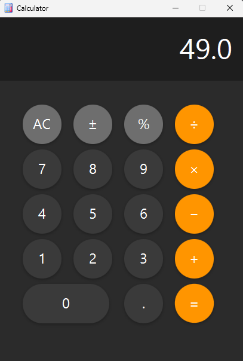

# JavaFX Calculator

A simple and clean calculator application built using **JavaFX**, **SceneBuilder**, and **IntelliJ IDEA**.  
The project demonstrates good JavaFX controller structure, event handling, and UI separation using FXML.

---

## Features

- Basic arithmetic operations:
    - Addition
    - Subtraction
    - Multiplication
    - Division
- Supports:
    - Decimals
    - Percentage (%)
    - Sign toggle (+/-)
    - Clear (C)
- UI created using **SceneBuilder**
- Clean and refactored JavaFX controller using:
    - Separate handlers for digits, operations, and special actions
    - Enum-based operation handling
    - Minimal if/else logic

---

## Technologies Used

| Technology | Purpose |
|-----------|---------|
| **JavaFX** | UI framework |
| **SceneBuilder** | Visual UI design |
| **IntelliJ IDEA** | Main IDE for development |
| **FXML** | UI markup structure |

---

## UI Preview

